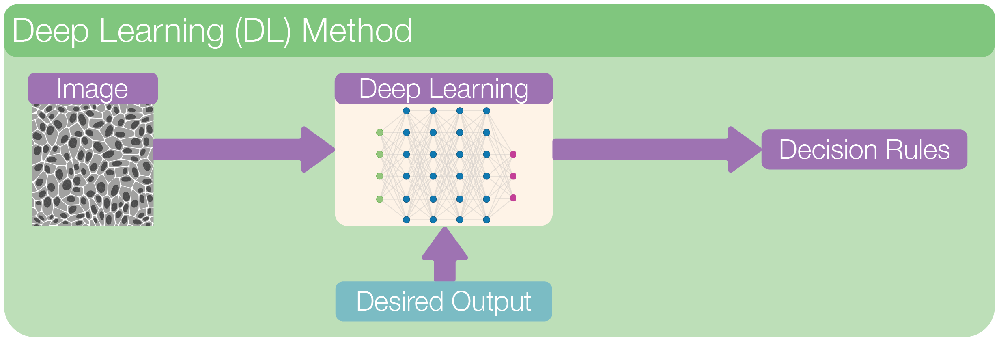
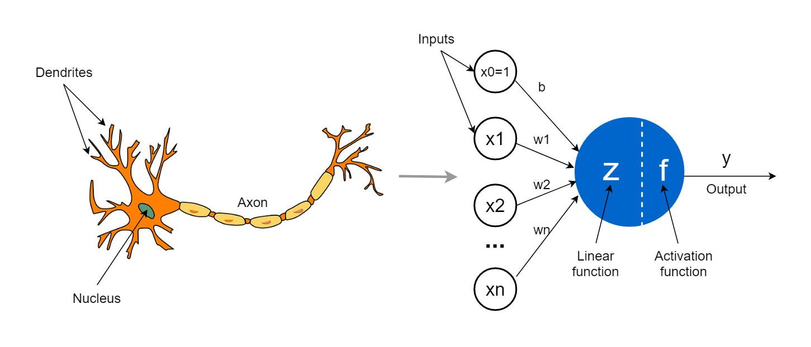
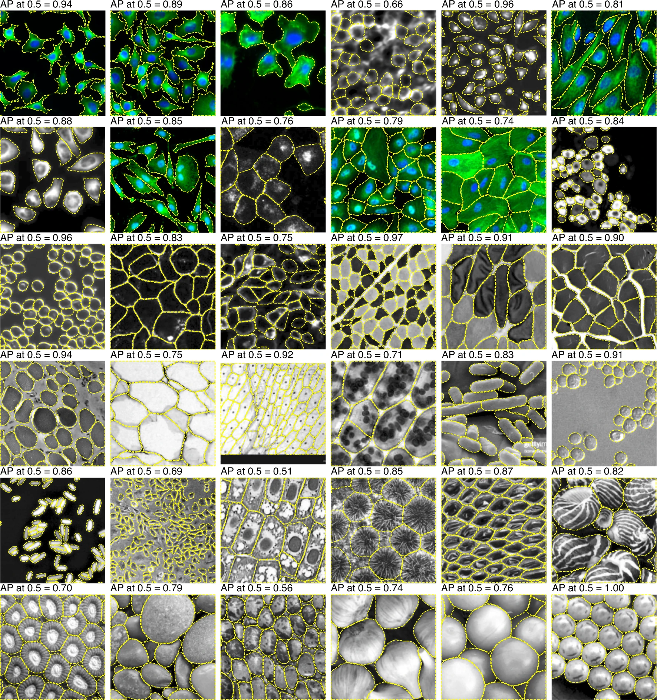
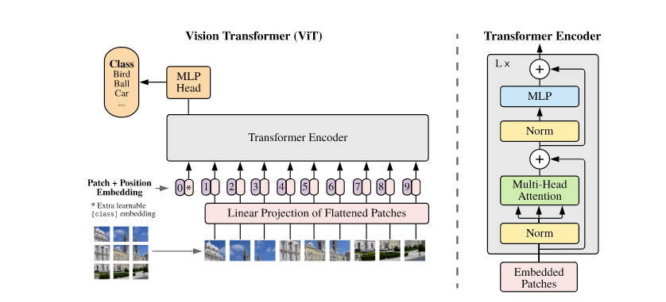
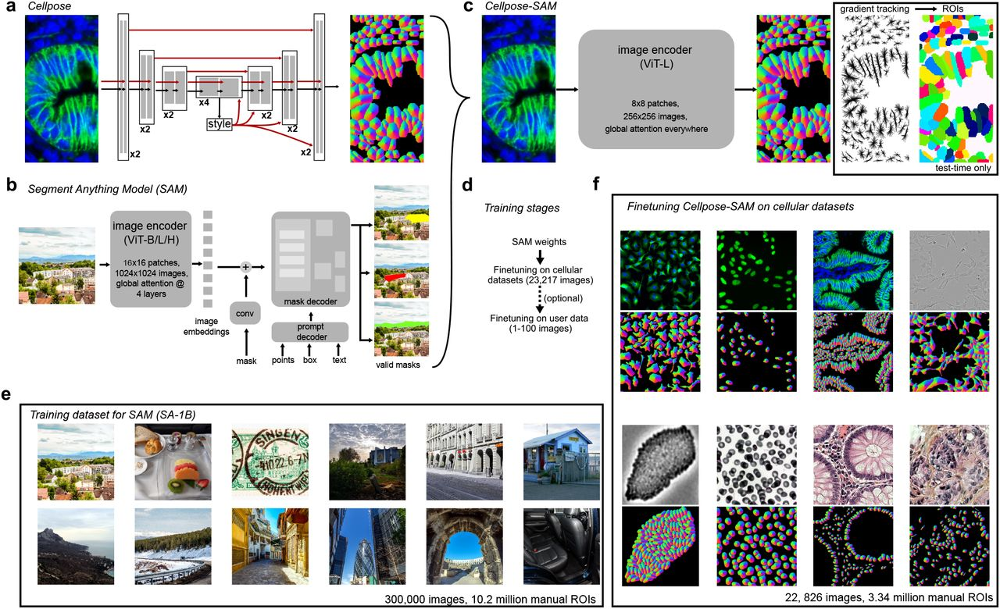

# Deep Learning Methods

Deep learning is a branch of machine learning that takes things a step further. Instead of relying on manually selected features (like edges or textures), deep learning models learn to extract **their own features** directly from raw image data. This makes them especially powerful for complex tasks like image segmentation.

    

 

In a typical deep learning workflow, we feed the entire image into a **neural network**, a multi-layered model inspired by the brain. Through training on many labeled examples, the network learns to recognize patterns, structures, and shapes in the image. Each layer in the network transforms the data a little more, gradually building up an understanding of what’s in the image.

Unlike traditional machine learning, we don’t need to tell the model *what* to look for—it figures that out on its own.

In **image segmentation**, deep learning models assign a class to each pixel (e.g., cell, background, nucleus) and output a full **segmentation mask**. These masks can capture fine details and handle challenging cases like overlapping cells, blurry edges, or varying lighting conditions.

Because deep learning learns directly from data and can model very complex relationships, it often outperforms classical and machine learning methods for robustness, however, this performance comes at a higher cost of training and data requirement.

---

## Neural Netwok

### What is a Neural Network?

A neural network is a mathematical model inspired by how the brain works. It is made up of layers of units called neurons, which are connected to each other and pass information forward.

Each neuron performs a very simple task:

1. It takes in numbers as input.
2. It combines them in a weighted way (like multiplying by importance).
3. It passes the result through a simple function.
4. It sends this value to the next layer of neurons.

If you stack many such layers on top of each other, you get a deep neural network—hence the term deep learning.

    

*Source: https://towardsdatascience.com/the-concept-of-artificial-neurons-perceptrons-in-neural-networks-fab22249cbfc/*

### How Does a Neural Network Learn?

Neural networks learn by example, not by rules.

Here’s how it works:

1. You give the model an image (e.g., of a cell) and the correct answer (a labeled segmentation mask).
2. The model makes a guess (its prediction).
3. It compares its guess to the correct answer using a loss function (a measure of error).
4. It updates its internal settings (weights) to do better next time.

This process is called training, and it's repeated over thousands of examples until the network gets good at making predictions.

<!-- ### What Makes Deep Learning Different?
Traditional algorithms follow explicit instructions that we write. For example:

- “If a pixel is brighter than 100, mark it as foreground.”
- “Apply a Gaussian blur, then find the edges.”

Deep learning, in contrast, learns its own instructions. It creates internal representations of features in the image and decides for itself how to best solve the task. This is powerful because:

- It can handle noise and variability.
- It finds patterns we might miss.
- It doesn’t need us to handcraft every rule.

**Key idea:** *We don’t program deep learning models—we train them.* -->

---

## Convolutional Neural Network (CNN) [2010 - ]

## What is a CNN?

A convolutional neural network (CNN) is a type of neural network specially designed for images.

Key Ideas in CNNs:

- **Convolutional layers:** Filters (or “kernels”) slide over the image and detect local patterns like edges, lines, or textures.
- **Pooling layers:** Downsample the image to retain important information while reducing size.
- **Stacked layers:** Combine many layers so the network can build up from simple features to complex ones (e.g., from edges to full cell shapes).

    

*Source: https://medium.com/@RaghavPrabhu/understanding-of-convolutional-neural-network-cnn-deep-learning-99760835f148*

CNNs became popular after the success of **AlexNet in 2012**, which won the ImageNet competition by a large margin. This moment marked the beginning of the modern deep learning era.

---

## Segmentation as a Pixel Classifier

While CNNs were first used for image classification (e.g., “Does this image contain a cat?”), biomedical researchers needed more: per-pixel predictions like “Which pixels belong to which cell?”

Early solutions tried to adapt classification networks into segmentation tasks by:

- Applying CNNs to small image patches
- Upsampling coarse predictions

But this was inefficient and inaccurate for fine biological structures.

    

*Source: SegNet: A Deep Convolutional Encoder-Decoder Architecture for Image Segmentation*

---

## Introducing U-Net [2015]

The real breakthrough for biomedical image segmentation came with the introduction of U-Net in 2015 by Ronneberger et al., developed specifically for segmenting cells in light microscopy images.

### Key Features

| Component                      | Function                                                                               |
| ------------------------------ | -------------------------------------------------------------------------------------- |
| **Encoder (contracting path)** | Learns what features are present. Downsamples the image while extracting key patterns. |
| **Decoder (expanding path)**   | Reconstructs the segmentation mask. Upsamples to original image size.                  |
| **Skip connections**           | Link encoder and decoder layers to preserve spatial details like edges and boundaries. |

    

*Source: U-Net: Convolutional Networks for Biomedical Image Segmentation*

### Why U-Net Works So Well for Bioimages:

- Works well even with small datasets.
- Preserves fine details through skip connections.
- Generalizes across different staining protocols and microscopy types.
- Can be trained end-to-end from raw images to segmentation masks.

---

## Cellpose [2020]: A Generalist Model Using Flow Fields

While U-Net was powerful, it sometimes struggled with complex shapes or overlapping cells. **Cellpose** took segmentation further by introducing flow fields, a way for the model to understand the shape and direction of each object.

**Cellpose** is designed to be a *generalist model* for microscopy cell-segmentation. Cellpose doesn’t just classify pixels; it learns how pixels move together to form a whole cell. That made it incredibly flexible, able to segment nuclei, cytoplasm, or even non-biological shapes, often without retraining.

### What’s New in Cellpose

- Introduces a novel idea: **flow fields**
  - For each pixel, the model predicts the direction it should move to reach the object center.
  - After computing this flow, pixels are grouped into objects.
- Trained on a diverse set of cell and tissue types—generalist approach.
- Works out of the box on many image types, without retraining.

    

*Source: Cellpose: a generalist algorithm for cellular segmentation*

### Advantages of Cellpose

- Doesn’t assume round shapes.
- Segments cytoplasm, cells, or nuclei—flexible across tasks.
- Minimal parameter tuning needed.
- Provides segmentation even on images with no close training data.

---

## Transformers and Vision Transformers [2019 - ]

In recent years, deep learning has gone through another big shift with the introduction of **transformers**—a model architecture originally developed for natural language processing (like in translation or chatbots).

Unlike CNNs, which focus on local patterns using small filters, transformers are designed to capture **global context**. That means they can see the “big picture” in an image and understand how different parts relate to each other—even if they’re far apart.

In 2020, researchers began adapting transformers to image analysis, calling them **Vision Transformers (ViT)**. These models cut the image into patches (like puzzle pieces) and learn relationships between them, rather than sliding a filter across the entire image like CNNs.

    

*Source: An Image is Worth 16x16 Words: Transformers for Image Recognition at Scale*

Vision transformers are particularly good at handling:

- Complex textures or shapes
- Large images with multiple objects
- Tasks that benefit from global attention (like segmentation with sparse guidance)

---

## Segment Anything Model (SAM) [2023]

One of the most talked-about applications of transformers in computer vision is the **Segment Anything Model (SAM)** from Meta AI. As the name suggests, SAM was built to **segment any object in any image**, given a simple prompt like a point, a box, or a rough scribble.

SAM is not specific to microscopy—but it’s powerful. It combines the flexibility of transformers with a unique prompt-based workflow. That means:

- You don’t need a full set of labels to segment something.
- You can just click on an image to guide the model.
- It works well across domains, from natural scenes to X-rays.

    

*Source: Segment Anything by Meta AI*

---

## CellposeSAM [2024]

While SAM is impressive, it wasn’t originally designed for the challenges of microscopy: fuzzy boundaries, overlapping cells, weak contrast, or varying staining. That’s where **CellposeSAM** comes in.

**CellposeSAM** combines the **generalist power of SAM** with the **domain-specific strengths of Cellpose**, creating a flexible tool for **interactive cell segmentation**. Think of it as the best of both worlds.

### What’s New in CellposeSAM

- Uses **SAM’s transformer-based segmentation head** for high-quality boundaries.
- Integrates **Cellpose’s cell-aware flow fields** for better handling of microscopy-specific structures.
- Supports **interactive prompts** like clicks or masks to guide segmentation.

    

*Source: CellposeSAM (2024), Broad Institute / Chan Zuckerberg Initiative*

### Why It Matters

- Easy to interact with: Click a point, get a mask.
- Works on many image types: Brightfield, fluorescence, tissues, and more.
- Less manual work, more accuracy.

---

## Summary

Over the past decade, we’ve gone from:

- **Hand-crafted features** (machine learning),
- to **image-specific models** (CNNs),
- to **segmentation models** **U-Net**
- to **generalist architectures** for cell-segmentation **Cellpose**,
- and now to **promptable, transformer-powered models** like **SAM and CellposeSAM**.

In the next section, we’ll explore how to use **CellposeSAM** in practice.
