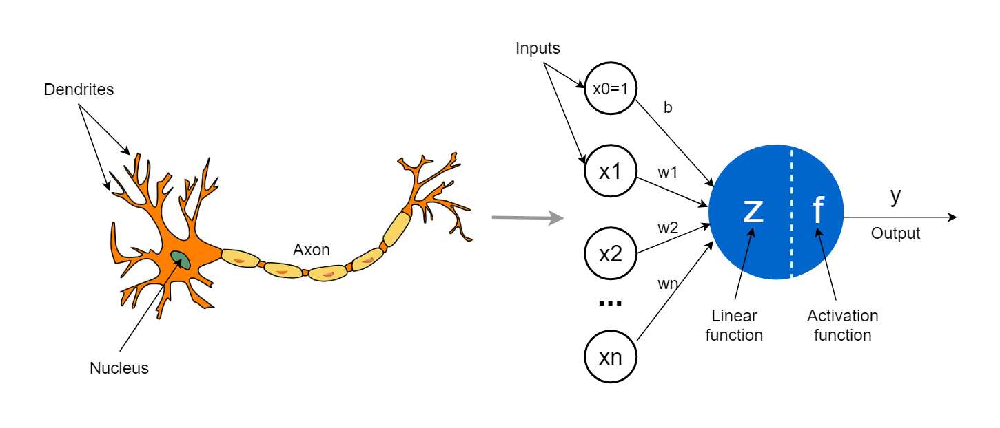

# A Gentle Introduction to Deep Learning for Microscopy

---

## Introduction

Welcome everyone. Today, we’re going to begin our journey into the world of deep learning—specifically, how it's transforming the way we analyze microscopy images. You don’t need any background in programming or machine learning. My goal is to equip you with just enough intuition and shared vocabulary so that when we move on to using tools like Cellpose and StarDist, you’ll understand not only how they work but why they were developed in the first place.

---

## What is Deep Learning?

This section introduces the basic ideas behind deep learning in an intuitive, non-technical way. It aims to explain what neural networks are, how they “learn,” and why these methods are so powerful for tasks like segmentation in biological images.

### What is a Neural Network?

A neural network is a mathematical model inspired by how the brain works. It is made up of layers of units called neurons, which are connected to each other and pass information forward.

Each neuron performs a very simple task:
1. It takes in numbers as input.
2. It combines them in a weighted way (like multiplying by importance).
3. It passes the result through a simple function.
4. It sends this value to the next layer of neurons.

If you stack many such layers on top of each other, you get a deep neural network—hence the term deep learning.

    

*Source: https://towardsdatascience.com/the-concept-of-artificial-neurons-perceptrons-in-neural-networks-fab22249cbfc/*

### How Does a Neural Network Learn?
Neural networks learn by example, not by rules.

Here’s how it works:

1. You give the model an image (e.g., of a cell) and the correct answer (a labeled segmentation mask).
2. The model makes a guess (its prediction).
3. It compares its guess to the correct answer using a loss function (a measure of error).
4. It updates its internal settings (weights) to do better next time.

This process is called training, and it's repeated over thousands of examples until the network gets good at making predictions.

### What Makes Deep Learning Different?
Traditional algorithms follow explicit instructions that we write. For example:

- “If a pixel is brighter than 100, mark it as foreground.”
- “Apply a Gaussian blur, then find the edges.”

Deep learning, in contrast, learns its own instructions. It creates internal representations of features in the image and decides for itself how to best solve the task. This is powerful because:

- It can handle noise and variability.
- It finds patterns we might miss.
- It doesn’t need us to handcraft every rule.

**Key idea:** *We don’t program deep learning models—we train them.*

### Why Deep Learning in Microscopy?

Traditionally, image segmentation in biology—identifying and outlining cells or nuclei—has been done manually or with classic image processing tools like thresholding, watershed, or morphology filters. These work… sometimes. But as you know, microscopy images vary a lot depending on sample prep, staining, and acquisition.

When cells are overlapping, touching, blurry, or oddly shaped, traditional methods often fail. Even manual segmentation can be inconsistent across annotators.

Deep learning offers a solution. It can learn from examples what a “cell” looks like—across many shapes, sizes, and imaging modalities. Once trained, these models can generalize and apply that learned knowledge to new, unseen images. That means more consistent results, faster analysis, and better scalability.

| Microscopy Challenge                      | How Deep Learning Helps                           |
| ----------------------------------------- | ------------------------------------------------- |
| Cells are irregular in shape and size     | Learns to recognize diverse morphologies          |
| Staining intensity varies                 | Learns robustness to signal variation             |
| Images are noisy or low contrast          | Learns to filter out noise and focus on structure |
| Objects are touching or overlapping       | Learns object-level context, not just edges       |
| Multiple modalities and channels          | Can integrate and process multi-channel data      |
| You want consistent, reproducible results | Always gives the same output for the same input   |

### Key Concepts
Let’s define a few foundational terms you’ll hear often in deep learning:

| Term              | Description                                                 |
| ----------------- | ----------------------------------------------------------- |
| **Training**      | Feeding a model many examples so it learns from data        |
| **Model**         | A trained neural network that makes predictions             |
| **Prediction**    | What the model outputs for a new image                      |
| **Loss Function** | A measure of how wrong the model’s prediction is            |
| **Segmentation**  | Assigning a label (e.g., “nucleus”) to each pixel           |
| **Mask**          | A binary or multi-label image marking the structure         |
| **Ground Truth**  | The correct, human-annotated segmentation used for training |
