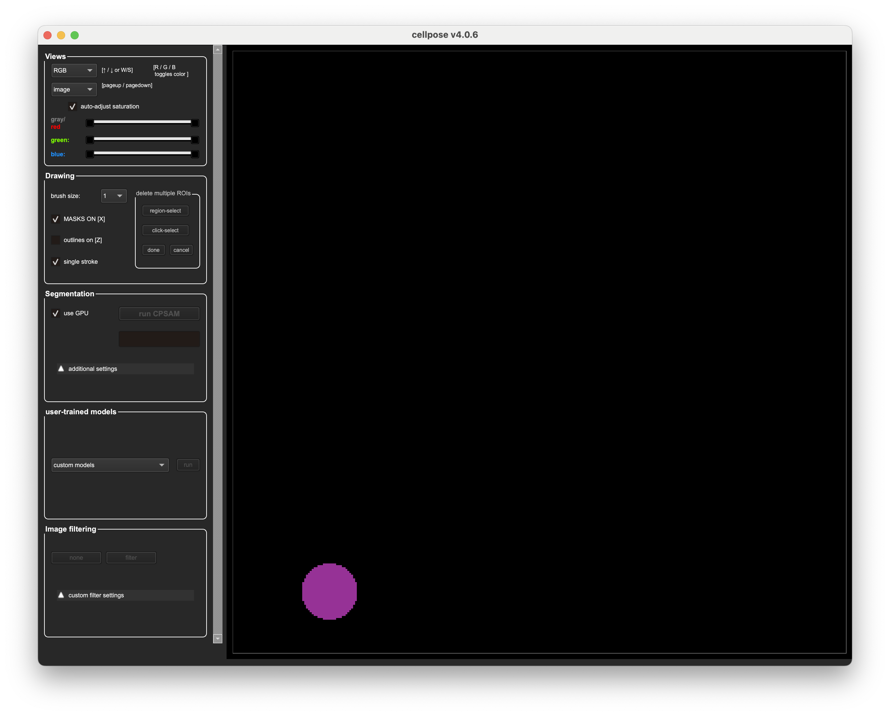

# Introduction to Cellpose

[**Cellpose**](https://www.cellpose.org) is a **free**, **open-source** software tool for **automatic cell segmentation** using **deep learning**. It is designed for **biological image analysis**, working on a wide range of microscopy images without requiring parameter tuning or extensive training data. It is a generalist image segmentation tool.

At its core, **Cellpose** uses a **pretrained deep neural network** to segment cells based on learned features. It supports both **2D** and **3D datasets**, and can handle a variety of **morphologies**, including nuclei, cytoplasm, whole cells, and irregular structures. Users can also **train custom models** using their own data if the pretrained model doesn't fit their needs.

<div align="center">
    
</div>

<br>

The project is well-supported with **documentation, tutorials, and example datasets**, all available on the [official website](https://www.cellpose.org) and [GitHub repository](https://github.com/MouseLand/cellpose).

## Download and Install Cellpose

**Cellpose** is available via:

* A **Python package** (recommended for scripting and integration into pipelines)
* A **Graphical User Interface (GUI)** for interactive use

<div align="center">
    
</div>

Below are the instructions to install Cellpose using [`uv`](https://docs.astral.sh/uv/).

<p class="alert alert-warning">
    <strong>Note:</strong> If you want to use latest CellposeSAM model, make sure to run it using GPU or it will be very slow. If you have an Apple Silicon Mac, you can take advantage of the built-in GPU.
</p>

You can use `uv` to use/install Cellpose in three ways:

1. **Direct execution**: Use `uv` to automatically handle environment creation and run the GUI directly
2. **Manual environment setup**: Create a virtual environment first, then install Cellpose within that environment
3. **Jupyter Notebook Integration**: Use `uvx juv` with the Jupyter notebooks from this course to run the Cellpose notebooks directly in the browser

### 1. Direct Execution with uv

By simply running the command below, `uv` will create a virtual environment, install Cellpose, and launch the GUI (it might take a little while the first time you run this command but after that it will be very quick).

```bash
uvx "cellpose[gui]"
```

### 2. Manual Environment Setup

If you need to use Cellpose for scripting and integration into pipelines, it is then useful to set up a virtual environment manually. Here are the steps:

**2.1. Create a new virtual environment:**

When using `uv`, you can create a virtual environment with the following command:

```bash
uv venv cellpose-env
```

**2.2. Activate the virtual environment:**

```bash
# On Linux or macOS
source cellpose-env/bin/activate
# On Windows use 
cellpose-env\Scripts\activate
```

**2.3. Install Cellpose:**

```bash
uv pip install cellpose
```

If you will also need to run the Cellpose through the GUI, you should install it with GUI support:

```bash
uv pip install "cellpose[gui]"
```

And then, to launch the GUI:

```bash
python -m cellpose # (or simply cellpose)
```

### 3. Jupyter Notebook Integration

To run for example the [Cellpose Notebook](cellpose_notebook.ipynb) locally in your browser, you can use the following command:

```bash
# for the cellpose notebook
uvx juv run path/to/cellpose_notebook.ipynb # (or simply juv run cellpose_notebook.ipynb if you have the tool)
```

## What's Next?

In the next sections, we will briefly demonstrate how to use Cellpose through the GUI] and then focus more on how to use [Cellpose in scripts and pipelines](cellpose_notebook.ipynb) to automate the segmentation process on multiple images. We will also show how to [train a Cellpose custom models](cellpose_retraining_colab.ipynb) if the pretrained model does not fit your specific needs.
