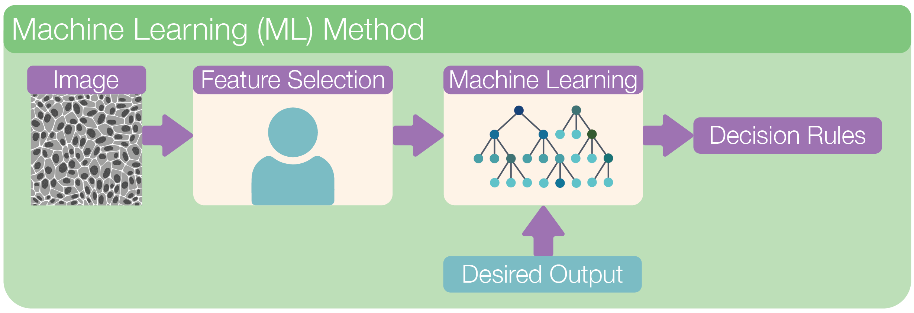

# Machine Learning Methods

Machine learning is a subfield of artificial intelligence where algorithms learn patterns from data to make decisions or predictions. In image analysis, machine learning methods are used to automate the interpretation of complex images, such as those from microscopes.

    

 

First, we start by **extracting features** from the image. These features can include intensity, texture, shape, or edges, basically any measurable property of the image that helps describe what’s in it. A machine learning model is then trained on these features to learn patterns and distinguish between different structures or regions.

Compared to classical rule-based methods, machine learning approaches are often more accurate and robust, especially when dealing with noisy or variable image data.

In **image segmentation**, machine learning is commonly used to classify each pixel (or group of pixels) into different categories, such as cell vs. background. This is done by training a **classifier** using extracted features so the model can decide which class a pixel belongs to. The result is a segmentation mask that outlines the regions of interest in the image, enabling further analysis like counting or measuring biological structures.

In the following chapters, we will learn how to perform image segmentation using **Ilastik**.