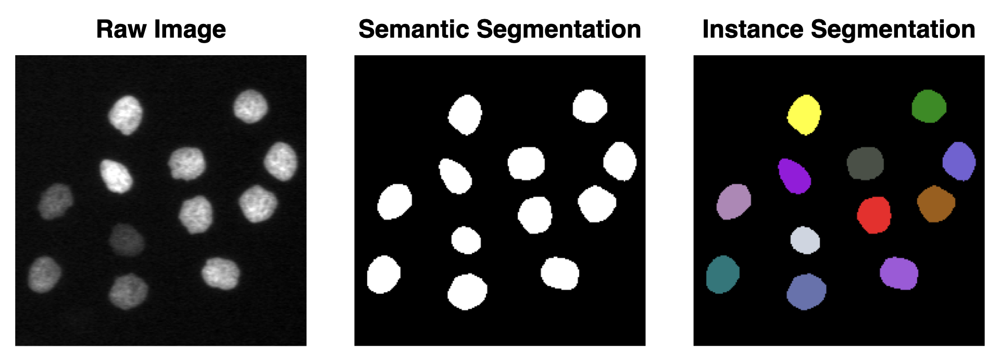

# 05 - <i class="fa-solid fa-disease"></i> Image Segmentation

**Segmentation** is a fundamental image analysis technique in bioimage analysis that involves **partitioning an image into distinct regions or objects** based on specific criteria, such as intensity, color, texture, or morphological features. This process is essential for quantitative analysis of biological structures, enabling researchers to measure, count, and characterize individual cells, organelles, or other biological entities within complex images.

There are two primary types of segmentation approaches: **semantic segmentation** and **instance segmentation**.

**Semantic segmentation** classifies each pixel in an image into predefined categories (e.g., background, nuclei, cytoplasm), treating all objects of the same class as a single entity without distinguishing between individual instances.

In contrast, **instance segmentation** goes a step further by not only classifying pixels but also **distinguishing between separate objects** of the same class, providing unique labels for each individual object (e.g., identifying nucleus #1, nucleus #2, etc.).

  
 

During the course we will explore different executions to achieve semantic and instance segmentation. We will first follow a [**classical method**](./classic/classic.md) based on *filtering* and *thresholding*, then we will explore [**machine learning** methods using the **Ilastik**](./machine_learning/intro_to_ilastik.md) open-source software, and finally we will delve into [**deep learning** methods using **Cellpose**](./deep_learning/deep_learning_with_cellpose.md).

  

This figure illustrates the evolution of image analysis methods, highlighting the shift from manual processes to fully automated systems.

Initially, in the **Classic Method**, both feature selection and decision-making were performed manually by human experts, relying heavily on domain knowledge and predefined rules.
 
With the advent of the **Machine Learning (ML) Method**, the process became partially automated—while experts still manually selected relevant features *(feature engineering)* from the image, the decision rules were learned by algorithms using training data *(such as decision tree, logistic regression etc.)*.
 
The most recent advancement, the **Deep Learning (DL) Method**, represents a fully automated approach. Here, the model learns both the features and decision rules directly from the raw image data, requiring minimal human intervention.

This evolution reflects a step towards more general and robust methods which reduces human subjectivity and bias, however, the data requirement ha also increased.

## Table of Contents

- [Classical Segmentation](./classic/classic.md)
- [Machine Learning: Ilastik](./machine_learning/intro_to_ilastik.md)
- [Deep Learning: Cellpose](./deep_learning/deep_learning_with_cellpose.md)
