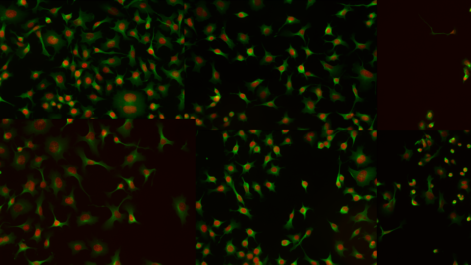

# <i class="fa-solid fa-user-group"></i> Student Group Work

## Overview

Your turn! The goal of this group work is to apply the knowledge you have acquired in the course to develop a cell (instance) segmentation pipeline on 2D images provided. Think of using all the tools you have learned in the course: smoothing, thresholding, morphological operations, thresholding, watershed, deep learning, fine-tuning, etc. The only constraint is that your predicted masks should be .png images of the same size as the ground truth.

## Challenges

1. Segment the cell outlines.

You are given a training set of 7 images and their corresponding ground truth masks. Your task is to take advantage of this training set to develop a segmentation pipeline that can segment the cell outlines in the images as closely as possible to the ground truth. Then, you are given 3 test images to evaluate your pipeline against their corresponding ground truth masks that are kept secret.

2. Segment the cell outlines (noisy image).

You are given a single raw image, without its corresponding ground truth mask. Your task is to develop a segmentation pipeline that can segment the cell outlines in the image as closely as possible to the ground truth that is kept secret.

3. Segment the nuclei.

You are given a single raw image of nuclei, without its corresponding ground truth mask. Your task is to develop a segmentation pipeline that can segment the nuclei in the image as closely as possible to the ground truth that is kept secret. Images are taken from the Broad Bioimage Benchmark Collection: https://bbbc.broadinstitute.org/BBBC006.

## Download the dataset

<a href="../_static/data/student_group_work.zip" download> <i class="fas fa-download"></i> Download the segmentation challenge dataset </a>

## Leaderboard

The leaderboard is available at [BoBIAC 2025 Segmentation Leaderboard](https://liveboard-bobiac.onrender.com/).

## Evaluation metrics

Evaluating segmentation pipelines is a complex task, and there is no single metric that can capture all the aspects of the performance. We have chosen to use the following metrics:

**The leaderboard will be based on the mAP metric. The other metrics are also important, but we will not use them to rank teams.**

--- 
- **mAP**: The mean average precision is the average of the average precision for each class. It is computed as the area under the precision-recall curve.

$$
\text{mAP} = \frac{1}{n} \sum_{i=1}^{n} \text{AP}_i = \frac{1}{n} \sum_{i=1}^{n} \int_{0}^{1} \text{Precision}_i(r) \text{Recall}_i(r) dr
$$

---

- **Precision**: The precision is the percentage of pixels that are correctly classified.

$$
\text{Precision} = \frac{\text{Number of correctly classified pixels}}{\text{Total number of pixels}}
$$

- **Recall**: The recall is the percentage of pixels that are correctly classified.

$$
\text{Recall} = \frac{\text{Number of correctly classified pixels}}{\text{Total number of pixels in the ground truth}}
$$

- **Intersection over Union (IoU)**: The intersection over union is the ratio of the intersection of the predicted and ground truth masks to the union of the two masks.

$$
\text{IoU} = \frac{\text{Intersection}}{\text{Union}}
$$

- **Pixel accuracy**: The pixel accuracy is the percentage of pixels that are correctly classified.

$$
\text{Pixel accuracy} = \frac{\text{Number of correctly classified pixels}}{\text{Total number of pixels}}
$$

- **Mean Intersection over Union (mIoU)**: The mean intersection over union is the average of the intersection over union for each class.

$$
\text{mIoU} = \frac{1}{n} \sum_{i=1}^{n} \frac{\text{Intersection}_i}{\text{Union}_i}
$$

- **Pixel F1 score**: The pixel F1 score is the harmonic mean of the precision and recall.

$$
\text{Pixel F1 score} = 2 \times \frac{\text{Precision} \times \text{Recall}}{\text{Precision} + \text{Recall}}
$$
